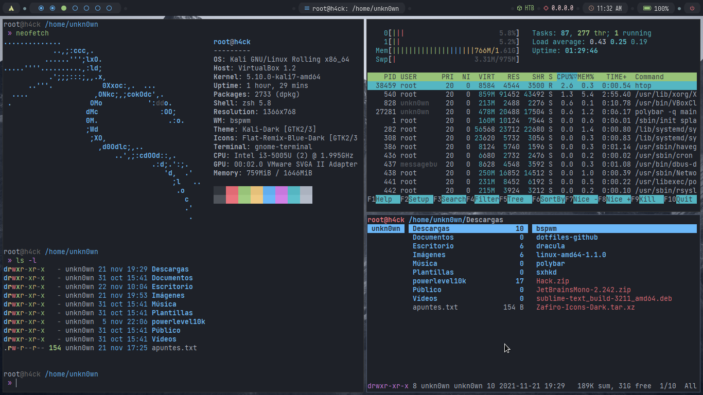

<h1 align="center">Dotfiles & Configs</h1>	

## Dependencias
* bspwm
* sxhkd
* polybar
* xcompmgr
* rofi
* Gnome-terminal
* zsh
* powerlevel10k
* Feh

## Pasos de la instalación(Ubuntu/Kali-Parrot)
__NOTA:__ Es recomendable que use la ruta ``~/Downloads`` o ``~/Descargas`` para clonar y descargar los archivos 
1. Actualiza los repositorios:

		 sudo apt update
2. Actualiza el sistema:

		 sudo apt upgrade
3. Instalando __bspwm__:

	Instalando las dependencias requeridas para el funcionamiendo de bspwm:

		 sudo apt install build-essential git xcb libxcb-util0-dev libxcb-ewmh-dev libxcb-randr0-dev libxcb-icccm4-dev libxcb-keysyms1-dev libxcb-xinerama0-dev libasound2-dev libxcb-xtest0-dev libxcb-shape0-dev
	Clonar el respositorio oficial de bspwm:

		 cd ~/Downloads; cd ~/Descargas
		 git clone https://github.com/baskerville/bspwm.git
	Compilar e instalar bspwm:
			 
		 cd bspwm
		 make
		 sudo make install
	Copiar los archivos de configuración de bspwm:

		 mkdir ~/.config/bspwm
		 cp examples/bspwmrc ~/.config/bspwm
		 chmod +x ~/.config/bspwm/bspwmrc
		 cd ..
	__OPCIONAL:__ Configura bspwm a tu gusto:

		 nano ~/.config/bspwm/bspwmrc

4. Instalar __sxhkd__:
	
	Clonar el repositorio oficial de sxhkd:

		 git clone https://github.com/baskerville/sxhkd.git
	Compilar e instalar __sxhkd__:
			 
		 cd sxhkd
		 make
		 sudo make install
	Copiar los archivos de configuración de sxhkd:
			
		 mkdir ~/.config/sxhkd
		 cp ../bspwm/examples/sxhkdrc ~/.config/sxhkd
		 cd ..
	__OPCIONAL:__ Configura sxhkd a tu gusto:

		 nano ~/.config/sxhkd/sxhkdrc
	
5. Instalar la __Polybar__:
	
	Instalando las dependencias requeridas para el funcionamiendo de la polybar:

		 sudo apt install cmake cmake-data pkg-config python3-sphinx libcairo2-dev libxcb1-dev libxcb-util0-dev libxcb-randr0-dev libxcb-composite0-dev python3-xcbgen xcb-proto libxcb-image0-dev libxcb-ewmh-dev libxcb-icccm4-dev libxcb-xkb-dev libxcb-xrm-dev libxcb-cursor-dev libasound2-dev libpulse-dev libjsoncpp-dev libmpdclient-dev libcurl4-openssl-dev libnl-genl-3-dev
	Clonar el repositorio oficial de la polybar:
	
		 git clone --recursive https://github.com/polybar/polybar
	Compilar e instalar __Polybar__:

		 cd polybar
		 mkdir build
		 cd build
		 cmake ..
		 make -j$(nproc)
		 sudo make install
6. Instalar __xcompmgr__ (Compositor):
	
	Instalar __xcompmgr__:

		 sudo apt install xcompmgr -y

	---  
	 __NOTA:__ En esta oportunidad estoy usando __xcompmgr__ como compositor, usted puede usar cualquier otro como __picom__

	---

7. Instalar __rofi__:

	Instalando __rofi__:
	
		 sudo apt-get install rofi -y

8. Instalar __gnome-terminal__ (OPCIONAL): 
	
	Instalar __gnome-terminal__:

		 sudo apt install gnome-terminal -y

	Aplicando el tema nord en la terminal:
		
    		 sudo apt-get install dconf-cli uuid-runtime
		
		 
